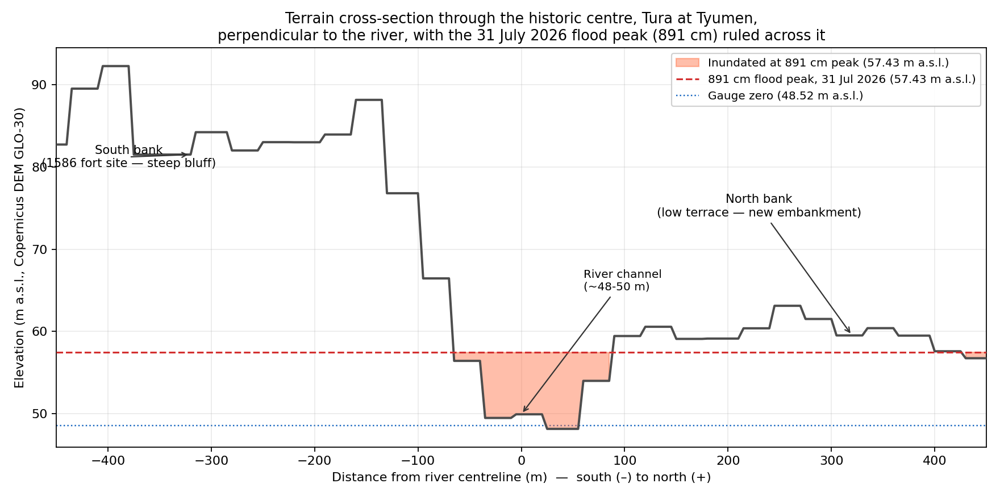
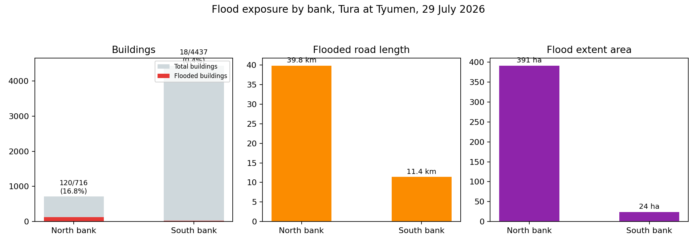

## Abstract

Tyumen was founded in 1586 as a Russian fort on the high, steep southern bank of the Tura river, leaving the low northern bank undeveloped. This study tests whether that siting decision still governs flood exposure in the city, using the record summer flood of July–August 2026, which peaked at 897 cm (57.49 m a.s.l.) on the city gauge on 2 August. Flood extent was mapped from Sentinel-2 L2A imagery for 18 June 2026 (pre-flood) and 29 July 2026 (near-peak) using the Modified Normalised Difference Water Index (MNDWI). A conventional fixed threshold failed on the flood-date scene, where cloud shadow suppressed the index over open water; the final method therefore constrains the spectral mask topographically, admitting only pixels that lie below the observed flood elevation and are hydrologically connected to a high-confidence water seed. Mapped flood extent reached 415.0 ha, of which 280.8 ha was newly inundated land. Exposure, derived from OpenStreetMap and WorldPop, is strongly asymmetric: the north bank accounts for 391.2 ha of flooded area, 120 of 716 buildings (16.8%), 39.8 km of road and approximately 5,080 residents, against 23.9 ha, 18 of 4,437 buildings (0.4%), 11.4 km and approximately 560 residents on the south bank. A DEM cross-section through the historic centre shows why: the south bank rises to roughly 90 m within 400 m of the channel, the north bank to only 59–63 m, lying 1–3 m above the flood line at several points. The 1586 siting logic therefore persists, but as a threshold rather than a boundary — an event of this size was sufficient to cross onto terrace ground that ordinary floods do not reach.

**Keywords:** flood mapping; Sentinel-2; MNDWI; path dependence; urban geography; Tura river; Tyumen

## Introduction

The present study investigates whether the historical choice of Tyumen's siting in 1586 — placing the settlement on the high, steep southern bank of the Tura river while leaving the low, broad northern bank undeveloped — still governs which bank is exposed to flood water, in view of the record summer flood of July–August 2026. Specifically, the paper examines whether the defensible-position reasoning established four centuries ago holds under the conditions of an extreme hydrological event, or whether the exceptional flood reveals a threshold above which the historical pattern of exposure ceases to operate. The question belongs to a broader literature on persistence and path dependence in economic geography, which asks how far the present spatial distribution of activity is determined by history rather than by geographic fundamentals, and how long the effects of a historical decision endure (Allen and Donaldson, 2022). Using Sentinel-2 optical imagery, a global digital elevation model (DEM) and OpenStreetMap data, the study maps the flood extent, measures exposure on each bank, and tests the historical premise against the catastrophic event.

## Study area

Tyumen (57.15°N, 65.53°E) is the oldest Russian city in Siberia, located on the banks of the Tura river, a right-bank tributary of the Tobol, which flows into the Irtysh, then into the Ob, and finally empties into the Kara Sea. The historical centre and the kremlin are located on the high, steep bluff of the south bank, which rises approximately 30–40 metres above the river within a few hundred metres of the channel. The northern bank, by contrast, is a more moderate terrace hosting docks, industry and, latterly, landscaped embankments and the so-called "second tier" (вторая надпойменная терраса). Historically, this latter area was built up above the first, lower terrace and is traditionally considered to lie outside the ordinary flood extent.

Figure 1 sets out this asymmetry directly. Panel (a) maps the terrain of the study reach from the Copernicus DEM, locating the historic centre, the city gauge and the line of the cross-section discussed below; the colour ramp alone distinguishes the high southern bluff from the low northern terrace. Panel (b) places the Tura within the drainage chain that carries its water north to the Arctic Ocean, the wider system within which the July 2026 event occurred.

{width=100%}

In July 2026, prolonged heavy rainfall over the Tura's headwaters on the eastern slope of the Middle Urals produced a rapid rise several hundred kilometres downstream at Tyumen — a rain-generated summer flood rather than the spring snowmelt event that ordinarily sets the annual maximum. As measured by the city gauge, whose zero point is set at 48.52 metres above sea level (Baltic height system), the level reached 891 cm on 31 July and peaked at 897 cm — 57.49 metres above sea level — on 2 August 2026 (Kommersant, 2026; RuNews24, 2026). This was an absolute record for a summer flood at Tyumen, far above the previous summer maximum of 665 cm set in 1947, although it remained below the all-time maximum of 915 cm recorded during the spring snowmelt flood of May 1979 (RuNews24, 2026). A regional state of emergency for Tyumen and the Tyumen district was declared by Governor Alexander Moor with effect from midday on 28 July, at a level of 877 cm (The Moscow Times, 2026), the lower tiers of the city embankment were submerged, and volunteers — including the author of this paper — filled sandbags on the north bank over two days as the water spread into residential areas beyond the normal floodplain.

## Data and methods

**Imagery.** Two Sentinel-2 L2A (surface reflectance) images covering the MGRS tile T41VPD (UTM zone 41N, EPSG:32641) were obtained from the Sentinel-2 mission, whose multispectral instrument provides 10–20 m visible, near-infrared and shortwave-infrared bands on a five-day revisit with two satellites (Drusch et al., 2012). The images were obtained from the Copernicus Data Space Ecosystem using the Copernicus Browser: a cloud-free pre-flood image of **18 June 2026** and a flood image of **29 July 2026** (four days before the 2 August peak, when the gauge stood at 886 cm, and the closest cloud-free Sentinel-2 pass to the peak). Bands B02 (blue), B03 (green), B04 (red) and B11 (SWIR1, resampled to 10 m) were exported for both dates and co-registered on an identical grid (535 × 1599 pixels, approximately 5 m pixel spacing after the browser's resampling, bounds 652,040–654,950 mE, 6,333,099–6,341,879 mN).

**Water index.** For each date, the Modified Normalised Difference Water Index (Xu, 2006) was computed as

MNDWI = (B3 − B11) / (B3 + B11)

Water has high reflectance in the green band and strong absorption in the SWIR band, giving MNDWI values that are strongly positive over open water and negative over vegetation, soil and impervious surfaces. MNDWI was developed as a modification of the earlier NDWI, which used the near-infrared rather than the shortwave-infrared band (McFeeters, 1996); substituting SWIR was specifically intended to suppress built-up land, which NDWI tends to misclassify as water, and MNDWI is therefore the more appropriate index for an urban scene such as Tyumen (Xu, 2006).

**Masking.** A fixed MNDWI threshold of 0 — the default proposed by Xu (2006) and widely applied since — correctly delineated the river channel in the pre-flood image of 18 June 2026, but grossly underestimated the flooded area on 29 July 2026: the initial pass showed flooded pixels only 4.5% above the pre-flood baseline, contradicting the obvious widening of the river visible in the true-colour preview. Sampling band values directly along the cross-section transect revealed the reason: reflectance in the visible bands decreased 4–5× between the two dates while SWIR reflectance remained comparable — the signature of cloud shadow, not open water, suppressing MNDWI in the flood-peak image. Two conventional approaches to the problem were tried and rejected. Otsu's automatic thresholding (Otsu, 1979), which selects a threshold by maximising between-class variance, misclassified a large proportion of the built-up city as "water," since the method assumes an approximately bimodal distribution of values that an urban scene does not provide. A simple connected-component method (region growing) on a relaxed threshold leaked through shadowed streets and dark rooftops across the whole city while still failing to delineate the true flooded area near the gauge. This failure mode is well documented: shadow, dark roads and certain artificial surfaces return index values closely similar to those of water, and suppressing this built-up noise is a recognised problem in urban water mapping from Sentinel-2 (Yang et al., 2018).

The final method constrains the *spectral* water mask with a *topographic* one, using the Copernicus DEM GLO-30 (30 m resolution, reprojected to the Sentinel-2 grid by bilinear resampling). The underlying principle — that a pixel's plausibility as flood water depends on its height relative to the adjacent drainage, not on its spectral signature alone — follows the logic of the Height Above Nearest Drainage terrain model (Nobre et al., 2011), and the specific practice of refining a remotely sensed flood map by topographic and hydrological contextualisation, including region growing constrained by elevation, has been applied to SAR flood mapping in comparable settings (Hansen et al., 2025). The approach adopted here is a simplified variant suited to a single-scene optical analysis. A pixel is classified as water only if: (i) its MNDWI value exceeds a permissive threshold (−0.15 for the pre-flood date, −0.35 for the flood date, to account for shadow suppression); (ii) its DEM elevation lies below a hydrologically plausible cut-off (53 m above sea level for the pre-flood channel; 58.9 m a.s.l., i.e. 1.5 m above the 891 cm level of 31 July, for the flood date); and (iii) it is connected, via other qualifying pixels, to a strict high-confidence seed (MNDWI > 0.05 pre-flood, > −0.05 flood). Connectivity is implemented as 3×3 morphological opening followed by connected-component labelling in `scipy.ndimage`. This eliminates dark, low-lying but hydrologically disconnected false positives (shadowed rooftops on distant blocks) while preserving genuine flood water that is spectrally weak yet topographically and spatially consistent with the river. The resulting masks were polygonised in Python (`rasterio.features.shapes` + `geopandas`), which is functionally equivalent to the raster-to-vector conversion and MNDWI band math performed in QGIS; the QGIS project accompanying this report reproduces the same layers for inspection.

**Elevation profile.** A 900 m cross-section (450 m on each side of the river centreline), perpendicular to the river and passing through the point on the channel nearest the gauge (57.1619°N, 65.5349°E), was extracted from the DEM at 5 m intervals.

**Exposure.** Buildings and roads were extracted from OpenStreetMap via the Overpass API (bounding box 65.50–65.56°E, 57.14–57.17°N; 5,153 building polygons, full road network). A north–south dividing line was defined from the local tangent of the OSM river centreline at the gauge point, calibrated against the known south-bank location of the Tyumen kremlin. Buildings and road segments intersecting the flood polygon were counted on each side. Population exposure was obtained directly from the WorldPop Global Project Population Data (unconstrained, 2020, 100 m resolution; Tatem, 2017) via its REST API for the flooded area on each bank, subdivided into manageable sub-polygons. All processing (band math, masking, polygonisation, cross-section extraction, exposure counting) was performed in Python using `rasterio`, `geopandas`, `shapely`, `scipy.ndimage` and `matplotlib`, and is documented in the accompanying repository. The pipeline allows re-execution of the entire analysis from the raw Sentinel-2 exports, the DEM tile and the OSM extract.

## Results

**Flood extent.** Figure 2 depicts the pre-flood and flood-peak scenes with the derived water masks overlaid. The pre-flood channel occupies 137.4 ha, including the meander lake north of the historic centre; the flood extent covers 415.0 ha, of which 280.8 ha (68%) constitutes newly inundated territory beyond the permanent channel. The flood extends markedly further north of the river, and into more densely built fabric, than it does to the south (Figure 2; Figure 4).

{width=100%}

**Cross-section.** Figure 3 shows the DEM cross-section through the historic centre, oriented perpendicular to the river, with the 897 cm gauge peak (57.49 m a.s.l.) applied as a reference line. The channel bed lies at approximately 48–50 m a.s.l., consistent with the gauge datum (zero = 48.52 m). The south bank rises sharply, reaching approximately 90 m within about 400 m of the channel — a genuine bluff, and the site occupied by the 1586 fortress. The north bank, by contrast, is considerably more moderate, rising to only 59–63 m over the same distance, and at several points along the broader terrace it lies only 1–3 m above the 897 cm flood line. The flood line crosses approximately 515 m of the transect, almost all of it on the low north-bank side.

**Exposure.** Table 1 summarises exposure by bank (depicted also in Figure 4).

| | North bank | South bank |
|---|---:|---:|
| Flood extent | 391.2 ha | 23.9 ha |
| Buildings (total, OSM) | 716 | 4,437 |
| Buildings flooded | 120 (16.8%) | 18 (0.4%) |
| Roads flooded | 39.8 km | 11.4 km |
| Population exposed (WorldPop 2020) | ≈5,080 | ≈560 |

*Table 1. Flood exposure by bank, 29 July 2026. Sources: buildings and roads, OpenStreetMap contributors (via Overpass API); population, WorldPop Global Project Population Data (unconstrained, 2020, 100 m); flood extent, author's analysis (see Data and methods).*

Despite the fact that the south bank contains six times more buildings in total (including the historic centre and the majority of the contemporary city), the flooded area on the north bank is sixteen times larger, its proportion of flooded buildings is approximately forty times higher, and the estimated exposed population is roughly nine times greater. This is a clear and consistent result across every exposure metric, and it corresponds directly to the 1586 siting decision — to build the city on the high south bank while leaving the low north bank as floodplain — of which the observations in this paper represent a retrospective validation, 440 years later.

**The "second tier" question.** The cross-section explains why the narrative cannot be reduced to a simple binary of "north floods, south does not." Along most of the transect the north-bank terrace remains several metres above the inundation line and stayed dry; although the proportion of flooded buildings on the north bank is relatively high (16.8%), the majority of the terrace was not inundated. But wherever the terrace elevation approaches within 1–3 m of the flood line — observed at several points along the cross-section, and in the newly inundated blocks visible in Figure 2 — the 897 cm event was sufficient to cross it. At the peak, national reporting recorded 121 flooded homes and 53 people evacuated in the city (Kommersant, 2026): the reasoning of the 1586 siting (south = safe, north = exposed) is not a binary but a *threshold* relation. The north bank has always lain closer to the flood line, and an exceptionally large flood — the largest summer event in the Tyumen record, and within 18 cm of the all-time spring maximum — pushed parts of the terrace that had previously stood just above the threshold below it.

## Limitations

Several limitations affect the accuracy of these results, although they do not change their overall direction. First, the MNDWI/DEM masking technique, while minimising shadow contamination, may still underestimate water beneath dense vegetation canopy or within deep shadow that also falls below the elevation cut-off, and may overestimate very shallow, disconnected wet patches detected by the permissive threshold; the 3–4% change in area introduced by the geometric simplification used for the WorldPop query is a further, quantified source of imprecision. Second, all Sentinel-2 bands used in this analysis have a native resolution of 10–20 m (B11 resampled from 20 m); a single pixel can straddle the true flood boundary, and small buildings or short road segments near the edge of the flood extent may be misclassified as flooded or dry. Third, and most importantly, the 29 July image represents a single satellite overpass occurring four days before the peak, when the gauge stood at 886 cm against the eventual 897 cm — it therefore captures the flood at an advanced stage but not at its maximum. The flood extent mapped in this paper is consequently likely to be conservative (that is, smaller than the maximum extent), and the exposure figures should be interpreted as a lower bound for the 897 cm peak. Cloud cover prevented a cloud-free Sentinel-2 acquisition closer to the peak; Sentinel-1 SAR, whose active microwave sensing is unaffected by cloud and which is routinely used for flood mapping with exactly the kind of topographic contextualisation applied here (Hansen et al., 2025), could provide a near-peak extent map in future work, but was not required given the acceptable quality of the 29 July optical image. Finally, the north–south divide is a straight line derived from the local river tangent, a simplification of the Tura's actual meandering course, which will lead to slight misclassification of buildings and roads lying very close to the river itself.

## Implications

The results confirm the premise of the research question directly: four hundred and forty years after the founding of Tyumen and the selection of the high, steep southern bank of the Tura for its fortress, the same asymmetry — a steep, high southern bank and a gentle, low northern bank — still determines the bulk of flood exposure in the city, as seen in the DEM cross-section, in the satellite-derived flood extent, and in every exposure metric calculated in this paper. This is a striking example of historical-geographical path dependence: sixteenth-century military reasoning in choosing a defensive position persists through four centuries of landscape and continues to sort flood risk in the twenty-first. It is, however, a particular variety of persistence. Allen and Donaldson (2022) distinguish between spatial patterns that are path-dependent — sustained by history and by the accumulated investment that follows it — and those determined by geographic fundamentals that would reassert themselves regardless. Tyumen's case leans towards the latter: the asymmetry is anchored in terrain that has not moved, so the 1586 decision is better read as an accurate early reading of a durable physical constraint than as a self-reinforcing historical accident. The built environment that grew up around that reading is what converts the constraint into present-day exposure.

However, the 2026 event complicates the interpretation of that thesis. The north-bank "second tier," built up and occupied under the presumption of safety from ordinary flooding, was inundated — not because the geography behind that reasoning changed, but because a flood of exceptional size for the season was large enough to cross a threshold that ordinary floods do not reach. That this was a summer, rain-generated event rather than a spring snowmelt one matters: the terrace's safety margin had been established against a flood regime in which the annual maximum arrives with the melt, and the 2026 event arrived outside it. The 1586 siting logic should therefore be interpreted not as a fixed boundary between a flooded bank and a safe one, but as a gradient of exposure keyed to elevation above the channel: one that held reliably through four centuries of ordinary floods and failed only in the face of a single exceptional event. As climate and hydrological conditions change the frequency of such record events, the safety margin historically provided by the north-bank terrace may require revision rather than assumption.

## Data and code availability

All processing scripts, the derived flood-extent and exposure layers, the QGIS project and the figure files are available in the accompanying repository, https://github.com/ostriagin/tura-flood-tyumen-2026. Sentinel-2 L2A imagery is available from the Copernicus Data Space Ecosystem (dataspace.copernicus.eu); the Copernicus DEM GLO-30 tile is available from the public `copernicus-dem-30m` archive; OpenStreetMap data were retrieved via the Overpass API; WorldPop population data were retrieved via the WorldPop REST API. Exact retrieval parameters are documented in the repository README.

## Acknowledgements and use of AI tools

The research question, the field observations during the flood and the interpretation are the author's own. An AI assistant (Claude, Anthropic) was used to help write and debug the Python processing code, to locate and check sources, and to edit the text. Every figure and number reported here was checked against the data and sources cited, and the full processing code is published so that the analysis can be re-run independently.

## References

Allen, T. and Donaldson, D. (2022) 'Persistence and path dependence: A primer', *Regional Science and Urban Economics*, 94, 103724. doi: 10.1016/j.regsciurbeco.2021.103724

Kommersant (2026) 'Паводок в Тюмени: уровень воды на Туре достиг 896 см' ['Flood in Tyumen: the water level on the Tura has reached 896 cm'], 2 August. Available at: https://www.kommersant.ru/doc/8860971 (Accessed: 24 September 2026).

Drusch, M., Del Bello, U., Carlier, S., Colin, O., Fernandez, V., Gascon, F., Hoersch, B., Isola, C., Laberinti, P., Martimort, P., Meygret, A., Spoto, F., Sy, O., Marchese, F. and Bargellini, P. (2012) 'Sentinel-2: ESA's Optical High-Resolution Mission for GMES Operational Services', *Remote Sensing of Environment*, 120, pp. 25–36. doi: 10.1016/j.rse.2011.11.026

Hansen, M., Vejby, J. and Koch, J. (2025) 'Flood mapping using Sentinel-1 imagery with topographical and hydrological contextualization: Case study from Ribe, Denmark', *International Journal of Applied Earth Observation and Geoinformation*, 143, 104816. doi: 10.1016/j.jag.2025.104816

McFeeters, S.K. (1996) 'The use of the Normalized Difference Water Index (NDWI) in the delineation of open water features', *International Journal of Remote Sensing*, 17(7), pp. 1425–1432. doi: 10.1080/01431169608948714

Nobre, A.D., Cuartas, L.A., Hodnett, M., Rennó, C.D., Rodrigues, G., Silveira, A., Waterloo, M. and Saleska, S. (2011) 'Height Above the Nearest Drainage – a hydrologically relevant new terrain model', *Journal of Hydrology*, 404(1–2), pp. 13–29. doi: 10.1016/j.jhydrol.2011.03.051

Otsu, N. (1979) 'A Threshold Selection Method from Gray-Level Histograms', *IEEE Transactions on Systems, Man, and Cybernetics*, 9(1), pp. 62–66. doi: 10.1109/TSMC.1979.4310076

RuNews24 (2026) 'Губернатор Моор назвал летний паводок в Тюмени рекордным' ['Governor Moor calls the summer flood in Tyumen a record'], 14 August. Available at: https://runews24.ru/tumen/14/08/2026/gubernator-moor-nazval-letnij-pavodok-v-tyumeni-rekordnyim-za-vsyu-istoriyu-nablyudenij (Accessed: 24 September 2026).

The Moscow Times (2026) 'Tyumen Region Declares State of Emergency as It Braces for Major Flooding', 28 July. Available at: https://www.themoscowtimes.com/2026/07/28/tyumen-region-declares-state-of-emergency-as-it-braces-for-major-flooding-a93347 (Accessed: 24 September 2026).

Tatem, A.J. (2017) 'WorldPop, open data for spatial demography', *Scientific Data*, 4, 170004. doi: 10.1038/sdata.2017.4

Xu, H. (2006) 'Modification of normalised difference water index (NDWI) to enhance open water features in remotely sensed imagery', *International Journal of Remote Sensing*, 27(14), pp. 3025–3033. doi: 10.1080/01431160600589179

Yang, X., Qin, Q., Grussenmeyer, P. and Koehl, M. (2018) 'Urban surface water body detection with suppressed built-up noise based on water indices from Sentinel-2 MSI imagery', *Remote Sensing of Environment*, 219, pp. 259–270. doi: 10.1016/j.rse.2018.09.016
