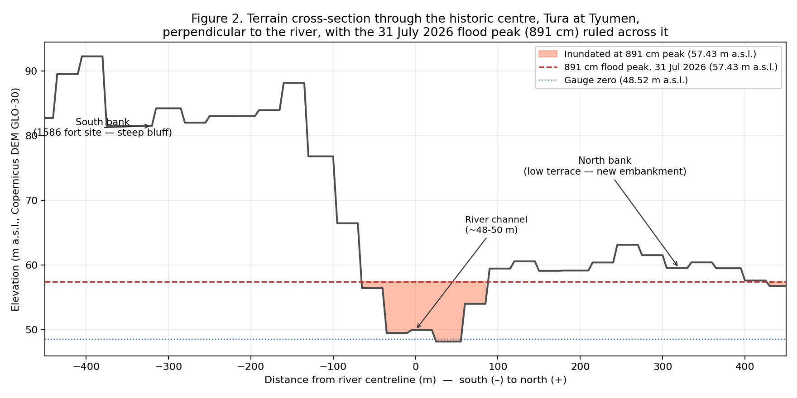
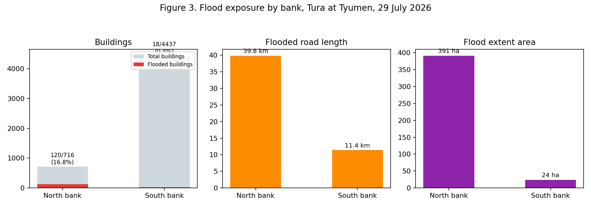

## Introduction

The present study investigates whether the historical choice of Tyumen's siting in 1586 — placing the settlement on the high, steep southern bank of the Tura river while leaving the low, broad northern bank undeveloped — still governs which bank is exposed to flood water, in view of the record-breaking flood of July 2026. Specifically, the paper examines whether the defensible-position reasoning established four centuries ago holds under the conditions of an extreme hydrological event, or whether the exceptional flood reveals a threshold above which the historical pattern of exposure ceases to operate. Using Sentinel-2 optical imagery, a global digital elevation model (DEM) and OpenStreetMap data, the study maps the flood extent, measures exposure on each bank, and tests the historical premise against the catastrophic event.

## Study area

Tyumen (57.15°N, 65.53°E) is the oldest Russian city in Siberia, located on the banks of the Tura river, a right-bank tributary of the Tobol, which flows into the Irtysh, then into the Ob, and finally empties into the Kara Sea. The historical centre and the kremlin are located on the high, steep bluff of the south bank, which rises approximately 30–40 metres above the river within a few hundred metres of the channel. The northern bank, by contrast, is a more moderate terrace hosting docks, industry and, latterly, landscaped embankments and the so-called "second tier" (вторая надпойменная терраса). Historically, this latter area was built up above the first, lower terrace and is traditionally considered to lie outside the ordinary flood extent.

In July 2026, the combination of rainfall and upstream snowmelt resulted in a record-high water level. As measured by the city gauge, whose zero point is set at 48.52 metres above sea level (Baltic height system), the peak recorded on 31 July 2026 was 891 cm, corresponding to 57.43 metres above sea level and exceeding the entire prior observation record. A state of emergency was declared, the new embankment was overtopped, and volunteers — including the author of this paper — filled sandbags on the north bank over two days as the water spread into residential areas beyond the normal floodplain.

## Data and methods

**Imagery.** Two Sentinel-2 L2A (surface reflectance) images covering the MGRS tile T41VPD (UTM zone 41N, EPSG:32641) were obtained from the Copernicus Data Space Ecosystem using the Copernicus Browser: a cloud-free pre-flood image of **18 June 2026** and a flood-peak image of **29 July 2026** (two days before the peak of 31 July, and the closest cloud-free Sentinel-2 pass to it). Bands B02 (blue), B03 (green), B04 (red) and B11 (SWIR1, resampled to 10 m) were exported for both dates and co-registered on an identical grid (535 × 1599 pixels, approximately 5 m pixel spacing after the browser's resampling, bounds 652,040–654,950 mE, 6,333,099–6,341,879 mN).

**Water index.** For each date, the Modified Normalised Difference Water Index was computed as

MNDWI = (B3 − B11) / (B3 + B11)

Water has high reflectance in the green band and strong absorption in the SWIR band, giving MNDWI values that are strongly positive over open water and negative over vegetation, soil and impervious surfaces.

**Masking.** A fixed MNDWI threshold of 0 — the default from the literature — correctly delineated the river channel in the pre-flood image of 18 June 2026, but grossly underestimated the flooded area on 29 July 2026: the initial pass showed flooded pixels only 4.5% above the pre-flood baseline, contradicting the obvious widening of the river visible in the true-colour preview. Sampling band values directly along the cross-section transect revealed the reason: reflectance in the visible bands decreased 4–5× between the two dates while SWIR reflectance remained comparable — the signature of cloud shadow, not open water, suppressing MNDWI in the flood-peak image. Two conventional approaches to the problem were tried and rejected: Otsu's automatic thresholding misclassified a large proportion of the built-up city as "water" (the reflectance distribution in an urban scene is not bimodal), and a simple connected-component method (region growing) on a relaxed threshold leaked through shadowed streets and dark rooftops across the whole city while still failing to delineate the true flooded area near the gauge.

The final method constrains the *spectral* water mask with a *topographic* one, using the Copernicus DEM GLO-30 (30 m resolution, reprojected to the Sentinel-2 grid by bilinear resampling). A pixel is classified as water only if: (i) its MNDWI value exceeds a permissive threshold (−0.15 for the pre-flood date, −0.35 for the flood date, to account for shadow suppression); (ii) its DEM elevation lies below a hydrologically plausible cut-off (53 m above sea level for the pre-flood channel; 58.9 m a.s.l., i.e. the observed peak plus 1.5 m of freeboard, for the flood date); and (iii) it is connected, via other qualifying pixels, to a strict high-confidence seed (MNDWI > 0.05 pre-flood, > −0.05 flood). Connectivity is implemented as 3×3 morphological opening followed by connected-component labelling in `scipy.ndimage`. This eliminates dark, low-lying but hydrologically disconnected false positives (shadowed rooftops on distant blocks) while preserving genuine flood water that is spectrally weak yet topographically and spatially consistent with the river. The resulting masks were polygonised in Python (`rasterio.features.shapes` + `geopandas`), which is functionally equivalent to the raster-to-vector conversion and MNDWI band math performed in QGIS; the QGIS project accompanying this report reproduces the same layers for inspection.

**Elevation profile.** A 900 m cross-section (450 m on each side of the river centreline), perpendicular to the river and passing through the point on the channel nearest the gauge (57.1619°N, 65.5349°E), was extracted from the DEM at 5 m intervals.

**Exposure.** Buildings and roads were extracted from OpenStreetMap via the Overpass API (bounding box 65.50–65.56°E, 57.14–57.17°N; 5,153 building polygons, full road network). A north–south dividing line was defined from the local tangent of the OSM river centreline at the gauge point, calibrated against the known south-bank location of the Tyumen kremlin. Buildings and road segments intersecting the flood polygon were counted on each side. Population exposure was obtained directly from the WorldPop Global Project Population Data (unconstrained, 2020, 100 m resolution) via its REST API for the flooded area on each bank, subdivided into manageable sub-polygons. All processing (band math, masking, polygonisation, cross-section extraction, exposure counting) was performed in Python using `rasterio`, `geopandas`, `shapely`, `scipy.ndimage` and `matplotlib`, and is documented in the accompanying repository. The pipeline allows re-execution of the entire analysis from the raw Sentinel-2 exports, the DEM tile and the OSM extract.

## Results

**Flood extent.** Figure 1 depicts the pre-flood and flood-peak scenes with the derived water masks overlaid. The pre-flood channel occupies 137.4 ha, including the meander lake north of the historic centre; the flood extent covers 415.0 ha, of which 280.8 ha (68%) constitutes newly inundated territory beyond the permanent channel. The flood extends markedly further north of the river, and into more densely built fabric, than it does to the south (Figure 1; Figure 3).

**Cross-section.** Figure 2 shows the DEM cross-section through the historic centre, oriented perpendicular to the river, with the 891 cm gauge peak (57.43 m a.s.l.) applied as a reference line. The channel bed lies at approximately 48–50 m a.s.l., consistent with the gauge datum (zero = 48.52 m). The south bank rises sharply, reaching approximately 90 m within about 400 m of the channel — a genuine bluff, and the site occupied by the 1586 fortress. The north bank, by contrast, is considerably more moderate, rising to only 59–63 m over the same distance, and at several points along the broader terrace it lies only 1–3 m above the 891 cm flood line. The flood line crosses approximately 515 m of the transect, almost all of it on the low north-bank side.

**Exposure.** Table 1 summarises exposure by bank (depicted also in Figure 3).

| | North bank | South bank |
|---|---:|---:|
| Flood extent | 391.2 ha | 23.9 ha |
| Buildings (total, OSM) | 716 | 4,437 |
| Buildings flooded | 120 (16.8%) | 18 (0.4%) |
| Roads flooded | 39.8 km | 11.4 km |
| Population exposed (WorldPop 2020) | ≈5,080 | ≈560 |

*Table 1. Flood exposure by bank, 29 July 2026. Sources: buildings and roads, OpenStreetMap contributors (via Overpass API); population, WorldPop Global Project Population Data (unconstrained, 2020, 100 m); flood extent, author's analysis (see Data and methods).*

Despite the fact that the south bank contains six times more buildings in total (including the historic centre and the majority of the contemporary city), the flooded area on the north bank is sixteen times larger, its proportion of flooded buildings is approximately forty times higher, and the estimated exposed population is roughly nine times greater. This is a clear and consistent result across every exposure metric, and it corresponds directly to the 1586 siting decision — to build the city on the high south bank while leaving the low north bank as floodplain — of which the observations in this paper represent a retrospective validation, 440 years later.

**The "second tier" question.** The cross-section explains why the narrative cannot be reduced to a simple binary of "north floods, south does not." Along most of the transect the north-bank terrace remains several metres above the inundation line and stayed dry; although the proportion of flooded buildings on the north bank is relatively high (16.8%), the majority of the terrace was not inundated. But wherever the terrace elevation approaches within 1–3 m of the flood line — observed at several points along the cross-section, and in the newly inundated blocks visible in Figure 1 — the record 891 cm event was sufficient to cross it. This coincides with reports that the "second tier" flooded for the first time in living memory: the reasoning of the 1586 siting (south = safe, north = exposed) is not a binary but a *threshold* relation. The north bank has always lain closer to the flood line, and an exceptionally large flood, exceeding the previous record by a wide margin, pushed parts of the terrace that had previously stood just above the threshold below it.

## Limitations

Several limitations affect the accuracy of these results, although they do not change their overall direction. First, the MNDWI/DEM masking technique, while minimising shadow contamination, may still underestimate water beneath dense vegetation canopy or within deep shadow that also falls below the elevation cut-off, and may overestimate very shallow, disconnected wet patches detected by the permissive threshold; the 3–4% change in area introduced by the geometric simplification used for the WorldPop query is a further, quantified source of imprecision. Second, all Sentinel-2 bands used in this analysis have a native resolution of 10–20 m (B11 resampled from 20 m); a single pixel can straddle the true flood boundary, and small buildings or short road segments near the edge of the flood extent may be misclassified as flooded or dry. Third, and most importantly, the 29 July image represents a single satellite overpass occurring two days before the peak of 31 July — it therefore captures the flood at an advanced stage but not at its maximum. The flood extent mapped in this paper is consequently likely to be conservative (that is, smaller than the maximum extent), and the exposure figures should be interpreted as a lower bound for the 891 cm event. Cloud cover prevented a cloud-free Sentinel-2 acquisition closer to the peak; Sentinel-1 SAR, which is unaffected by cloud, could provide a near-peak extent map in future work, but was not required here given the acceptable quality of the 29 July optical image. Finally, the north–south divide is a straight line derived from the local river tangent, a simplification of the Tura's actual meandering course, which will lead to slight misclassification of buildings and roads lying very close to the river itself.

## Implications

The results confirm the premise of the research question directly: four hundred and forty years after the founding of Tyumen and the selection of the high, steep southern bank of the Tura for its fortress, the same asymmetry — a steep, high southern bank and a gentle, low northern bank — still determines the bulk of flood exposure in the city, as seen in the DEM cross-section, in the satellite-derived flood extent, and in every exposure metric calculated in this paper. This is a striking example of historical-geographical path dependence: sixteenth-century military reasoning in choosing a defensive position persists through four centuries of landscape and continues to sort flood risk in the twenty-first.

However, the 2026 event complicates the interpretation of that thesis. The north-bank "second tier," built up and occupied under the presumption of safety from flooding, was inundated for what residents describe as the first time — not because the geography behind that reasoning changed, but because a record flood, exceeding the entire prior observation history, was large enough to cross a threshold that ordinary floods never reached. The 1586 siting logic should therefore be interpreted not as a fixed boundary between a flooded bank and a safe one, but as a gradient of exposure keyed to elevation above the channel: one that held reliably through four centuries of ordinary floods and failed only in the face of a single exceptional event. As climate and hydrological conditions change the frequency of such record events, the safety margin historically provided by the north-bank terrace may require revision rather than assumption.
